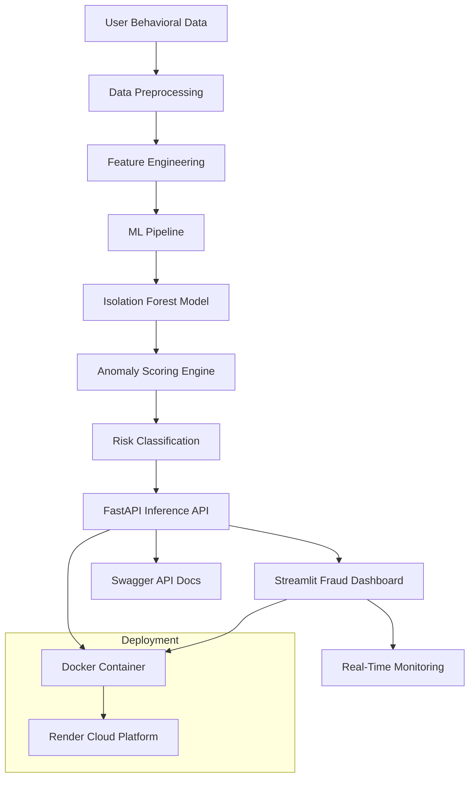

# 🛡️ AnomalyGuard AI

## Behavioral Fraud Intelligence Platform

AI-powered behavioral anomaly detection system for identifying suspicious user activity using Machine Learning, FastAPI, Docker, and Streamlit.

---

# 🔥 Live Demo

## 🌐 Fraud Intelligence Dashboard
https://anomalyguard-console.onrender.com

## ⚡ FastAPI Swagger Docs
https://anomalyguard-ai.onrender.com/docs

---

# 📌 Project Overview

AnomalyGuard AI is a production-grade behavioral anomaly detection platform designed to detect suspicious user behavior patterns using machine learning.

The system analyzes:
- Typing speed
- Mouse movement behavior
- Click frequency
- Session duration
- Behavioral deviations

to generate:
- anomaly scores
- fraud risk levels
- risk intelligence insights

---

# 🏗️ System Architecture

```text
                   ┌──────────────────────┐
                   │  Streamlit Dashboard │
                   │  Fraud Intelligence  │
                   └─────────┬────────────┘
                             │
                             ▼
                   ┌────────────────────┐
                   │ FastAPI Inference  │
                   │ Behavioral API     │
                   └─────────┬──────────┘
                             │
                             ▼
                   ┌────────────────────┐
                   │ ML Pipeline        │
                   │ Isolation Forest   │
                   └─────────┬──────────┘
                             │
                             ▼
                   ┌──────────────────────┐
                   │ Risk Scoring         │
                   │ Fraud Classification │
                   └──────────────────────┘
```
---

# 🧠 High-Level ML System Architecture


---

# 🚀 Tech Stack

| Category | Technologies |
|---|---|
| Machine Learning | Scikit-learn, Isolation Forest |
| Backend API | FastAPI |
| Frontend Dashboard | Streamlit |
| Visualization | Plotly |
| Containerization | Docker |
| Deployment | Render |
| Language | Python |
| Data Processing | Pandas, NumPy |

---

# 🧠 ML Pipeline

## Behavioral Features

- Typing Speed
- Mouse Speed
- Click Rate
- Session Duration
- Typing Variance
- Click Pattern Difference

---

## Anomaly Detection Model

```python
IsolationForest(contamination=0.1)
```

---

## Risk Scoring Logic

| Score Range | Risk Level |
|---|---|
| Low | Legitimate behavior |
| Medium | Suspicious behavior |
| High | Potential fraud |

---

# 📊 Dashboard Features

✅ Real-time fraud prediction  
✅ Behavioral analytics visualization  
✅ Risk meter gauge  
✅ Threat intelligence panel  
✅ Session anomaly monitoring  
✅ Live API integration  
✅ Interactive fraud simulator  

---

# ⚡ API Example

## POST `/predict`

### Request

```json
{
  "typing_speed": 220,
  "mouse_speed": 110,
  "click_rate": 6,
  "session_time": 350
}
```

---

### Response

```json
{
  "prediction": "Normal",
  "anomaly_score": 0.0489,
  "risk_level": "Low",
  "risk_score": 19
}
```

---

# 🐳 Docker Usage

## Build Docker Image

```bash
docker build -t anomaly-app -f docker/Dockerfile .
```

---

## Run Container

```bash
docker run -p 8000:8000 anomaly-app
```

---

# 🚀 Local Development

## Clone Repository

```bash
git clone https://github.com/RajeshKumar3451/Anomaly-Detection-System.git
cd Anomaly-Detection-System
```

---

## Install Dependencies

```bash
pip install -r requirements-api.txt
```

---

## Run API

```bash
uvicorn api.main:app --reload
```

---

## Run Dashboard

```bash
streamlit run dashboard/app.py
```

---

# 📂 Project Structure

```text
Behavioral-Anomaly-Detection/
│
├── api/
│   └── main.py
│
├── dashboard/
│   └── app.py
│
├── docker/
│   └── Dockerfile
│
├── models/
│   └── pipeline.pkl
│
├── src/
│   ├── data/
│   ├── features/
│   └── models/
│
├── requirements-api.txt
├── requirements-dashboard.txt
└── README.md
```

---

# 📈 Future Improvements

- LSTM Autoencoder
- Real-time WebSocket streaming
- Kafka integration
- JWT authentication
- Database logging
- MLflow monitoring
- Drift detection
- Kubernetes deployment

---

# 🏆 Key Achievements

✅ Production ML deployment  
✅ Real-time fraud intelligence  
✅ Dockerized AI infrastructure  
✅ Cloud-hosted inference API  
✅ Interactive security dashboard  
✅ End-to-end MLOps workflow  

---

# 📬 Contact

## Author
Rajesh Kumar

## GitHub
https://github.com/RajeshKumar3451/Anomaly-Detection-System

---

# ⭐ If you found this project useful

Give it a star on GitHub ⭐